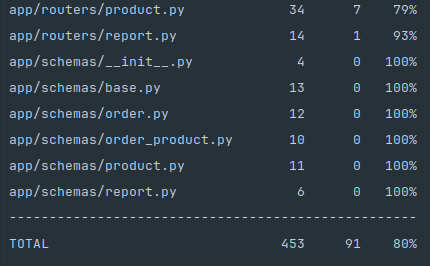
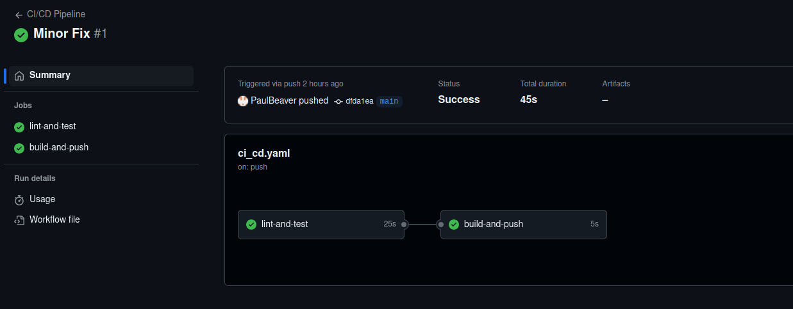
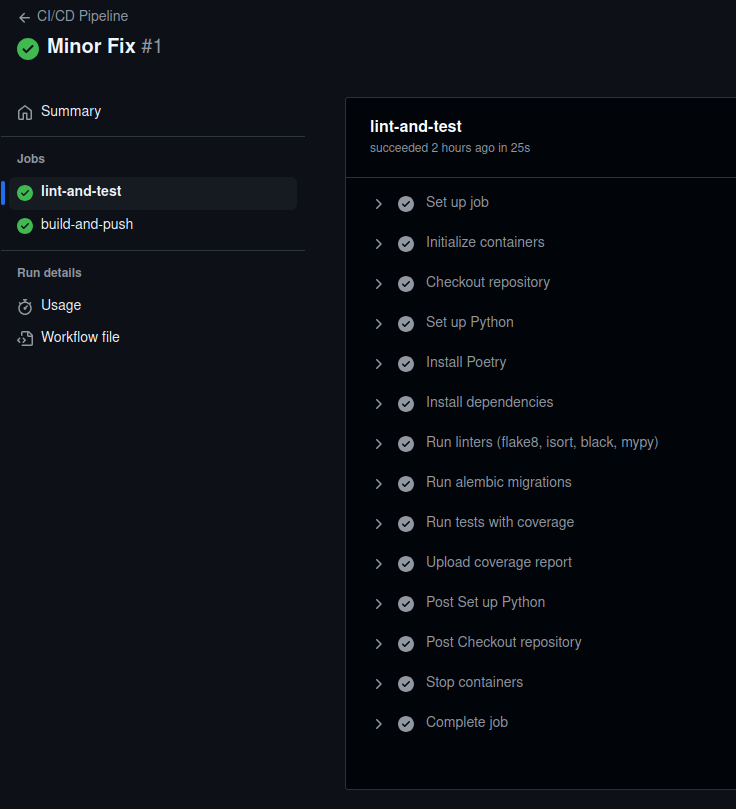
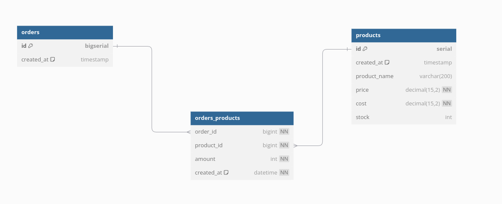

# Backend

This is a sample FastAPI-based application for managing products, orders, and order products. It includes CRUD APIs, database integration using SQLAlchemy, Pydantic models for data validation, caching with Redis, and a CI/CD pipeline using GitHub Actions.

---

## 🛠️ Features
- **Product Management (CRUD)**
- **Order Management (CRUD)**
- **Order Products Association**
- **Asynchronous PostgreSQL Access (SQLAlchemy Async)**
- **Redis Cache Integration**
- **Alembic Migrations**
- **Test Coverage with Pytest**
- **Docker and Docker Compose**
- **GitHub Actions CI/CD**

---

## Tech Stack
| **Technology** | **Purpose** |
|----------------|-------------|
| FastAPI        | Web framework |
| SQLAlchemy     | ORM for PostgreSQL |
| Alembic        | Database Migrations |
| Redis          | Caching |
| Pytest         | Testing |
| Docker         | Containerization |
| GitHub Actions | CI/CD Pipeline |

---

## 🛠️ Installation & Running Locally
- **1. Clone the repository** 
```bash
  git clone https://github.com/YourUsername/Backend_task.git
cd Backend_task
```
- **2. Create .env file** 
```bash
 DB_PORT=5432
DB_NAME=YOUR_DB_NAME
DB_USER=YOUR_DB_USER
DB_PASS=YOUR_DB_PASSWORD
DB_HOST=localhost
```
- **3. Run with Docker-Compose (Recommended)**
```bash
  docker-compose up --build
  
This will start:
FastAPI Application (localhost:8000)
PostgreSQL Database
Redis Cache
```


- **4. Run Locally**
```bash
  uvicorn app.main:app --reload
```
Access API Docs:
```bash 
  Swagger: http://127.0.0.1:8000/docs
 ```

---
## 🗄️ Database Migrations (Alembic)
Generate a new migration
```bash
  DB_HOST=localhost alembic revision --autogenerate -m "db_init"
```
Apply migrations:
```bash
  DB_HOST=localhost alembic upgrade head
```

---

## 🧪 Tests
Run Tests
```bash
  pytest
```
After running the tests, the coverage report is as follows:



---

### ⚙️ CI/CD Pipeline
This project uses GitHub Actions for CI/CD :
- Pre-commit hooks for code quality (Black, isort, flake8, mypy)
- Automatic testing on push/pull request
- Coverage report upload to Codecov




---
### 🗂️ Folder Structure
```bash
 app/
├── cahce.py         # Redis cache setup
├── config.py        # Environment config
├── crud/            # Database CRUD logic
├── db.py            # Database engine and session
├── main.py          # FastAPI entry point
├── midlewares/      # Custom middlewares
├── models/          # SQLAlchemy models
├── routers/         # Route definitions
├── schemas/         # Pydantic schemas
migrations/          # Alembic migrations
tests/               # Test suite
ztest/               # Local configuration and logs related to testing.
```
---

### 🗺️ Database Diagram
##### This is the entity-relationship diagram representing the database structure:

- orders: Stores order data

- products: Stores product details

- orders_products: Many-to-Many relationship table linking orders and products

##### Data types and constraints were chosen based on:
- bigserial for IDs because it allows auto-increment and is suitable for large datasets.

- timestamp for created_at fields to automatically store record creation time.

- decimal for price and cost to handle monetary values with precision.

- Foreign keys in orders_products to enforce data integrity between orders and products.

##### DB Schema:


---

## 🧑‍💻 API Endpoints

The project provides a RESTful API for managing products, orders, and the relationship between them. All endpoints are implemented using **FastAPI**, and the automatically generated documentation is available at:

- Swagger UI: [http://127.0.0.1:8000/docs](http://127.0.0.1:8000/docs)


### Key Endpoints:

#### 🛒 Orders
| Method | Endpoint               | Description                             |
|--------|--------------------------|------------------------------------------|
| GET    | `/orders-list`           | Retrieve a paginated list of orders     |
| GET    | `/orders-count`          | Get the total number of orders          |
| GET    | `/orders/{id}`           | Retrieve an order by ID                 |
| POST   | `/orders`                | Create a new order                      |
| DELETE | `/orders/{id}`           | Delete an order by ID                   |
| PUT    | `/orders/{id}`           | Update an existing order                |
| POST   | `/orders-batch`          | Batch create multiple orders            |
| DELETE | `/orders-batch`          | Batch delete orders by IDs              |

#### 📦 Products
| Method | Endpoint                 | Description                             |
|--------|--------------------------|------------------------------------------|
| GET    | `/products`               | Retrieve a paginated list of products   |
| GET    | `/products-count`         | Get the total number of products        |
| GET    | `/products/{id}`          | Retrieve a product by ID                |
| POST   | `/products`               | Create a new product                    |
| DELETE | `/products/{id}`          | Delete a product by ID                  |
| PUT    | `/products/{id}`          | Update an existing product              |
| POST   | `/products-batch`         | Batch create multiple products          |
| DELETE | `/products-batch`         | Batch delete products by IDs            |

#### 🔄 OrdersProducts (Order-Product Association)
| Method | Endpoint                  | Description                             |
|--------|---------------------------|------------------------------------------|
| GET    | `/orders_products-count`   | Get the total number of order-product links |
| GET    | `/orders_products/{id}`    | Retrieve an order-product link by ID    |
| POST   | `/orders_products`         | Create a new order-product link         |
| DELETE | `/orders_products/{id}`    | Delete an order-product link by ID      |
| PUT    | `/orders_products/{id}`    | Update an order-product link            |
| POST   | `/orders_products-batch`   | Batch create multiple order-product links |
| DELETE | `/orders_products-batch`   | Batch delete order-product links by IDs |

#### 📊 Reports
| Method | Endpoint     | Description                          |
|--------|--------------|---------------------------------------|
| GET    | `/reports-all`| Retrieve aggregated report data for orders and products |

#### 🌍 Default
| Method | Endpoint | Description                     |
|--------|----------|----------------------------------|
| GET    | `/`      | Health check (Hello, World!)     |

### Request and Response Formats:
- **Input Data:** JSON format.
- **Output Data:** JSON format.
- **Error Handling:** Unified structure for validation, HTTP, and server errors.

--- 

## 📝 Additional Information

### 🛠️ Error Handling
- The project includes a custom error-handling middleware to catch and format errors consistently.
- Catches **HTTPException**, **ValidationError**, and unexpected **500 errors**.
- Returns clear JSON responses with error details, improving the developer experience when using the API.

### 📄 Pagination
- All **GET** endpoints for large datasets (e.g., products, orders) support **pagination**.
- Default values: `page=1` and `page_size=2`.
- Helps improve performance when working with large amounts of data.

### ⚡ Performance Considerations
- **Indexes** have been added on foreign keys in the `orders_products` table to improve query performance.
- This is crucial when working with large datasets and complex JOIN queries in production environments.

### 🔄 Database Session Middleware
- A custom middleware is used to manage **database sessions**.
- Ensures that each request receives a fresh **AsyncSession** from the SQLAlchemy session factory.
- Automatically commits on success and rolls back on failure.

### 🪵 Logging
- Integrated **logging** using Python’s built-in `logging` module.
- Captures important application events and errors.
- Useful for debugging and tracking production issues.

### 🧪 Testing Approach
- The project uses **Pytest** for testing.
- **Fixtures** set up an isolated PostgreSQL test database and provide an `async_client` for HTTP API testing.
- This ensures **end-to-end** testing of the core application flow.

### 🔗 Database Relationships
- **One-to-Many Relationship**: Orders → OrdersProducts.
- **One-to-Many Relationship**: Products → OrdersProducts.
- **Many-to-Many Relationship**: Orders ←→ Products (through OrdersProducts).
- This relational structure is common in **e-commerce systems** to represent order line items.

### 🧑‍💻 Code Quality
- **Pre-commit hooks** enforce code quality using **Black**, **isort**, **flake8**, and **mypy**.
- Helps maintain clean and consistent code.

### 🔄 Batch Operations
- Batch endpoints are provided for **creating** and **deleting** multiple products, orders, and order-product links.
- Useful when dealing with **bulk data imports** or **cleanup operations**.

### 🛡️ Environment Variables
- Sensitive data (e.g., database credentials) is managed using `.env` files.
- Ensures **separation of configuration** from code and makes the application easy to deploy across different environments.

### 🔄 Redis Cache
- **Redis** is integrated for potential caching operations.
- Currently initialized, but can be extended to cache expensive queries in the future.

---
## 📝 Afterword

This project demonstrates the development of a scalable, modular FastAPI backend application with a focus on clean architecture, asynchronous database operations, and comprehensive testing. The structure is designed to be easily extensible, allowing additional features and business logic to be incorporated as the project evolves.

Key takeaways:
- The combination of **SQLAlchemy** (with async support) and **FastAPI** allows for efficient database interactions and rapid API development.
- Using **Alembic** for database migrations ensures database schema consistency across environments.
- The inclusion of **Redis caching** can significantly improve performance in production environments when working with frequently accessed data.
- The project emphasizes **testing** and **code quality** through **Pytest**, **pre-commit hooks**, and **CI/CD integration** with **GitHub Actions**.
- The **Docker setup** facilitates easy deployment and local development consistency.

This test task is intended to showcase my ability to design, build, and test a backend service with industry best practices.


---